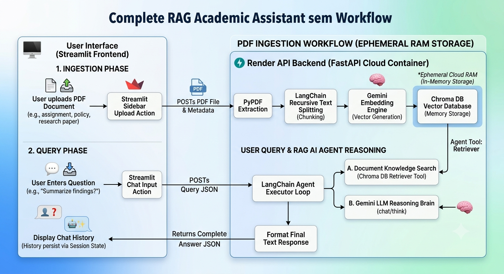

# 🎓 Dynamic Academic Assistant (Agentic RAG)

A production-ready, conversational AI Assistant that allows users to upload any academic PDF (lecture slides, research papers, course syllabi, or policies) and chat with it dynamically. This project utilizes a decoupled production architecture featuring an asynchronous backend API server and an interactive conversational frontend client dashboard.

👉 **Live Application Web UI:** [Access Live Streamlit Frontend](https://academicassistantusingrag-edm87cwp7gmre7amd56fdv.streamlit.app/)  
👉 **Live API Engine:** [Access Live Render Backend Endpoint](https://academic-assistant-using-rag.onrender.com/docs)

---

## 🏗️ System Architecture & Workflow

The platform operates across two separate cloud environments, handling computational workflows completely in-memory to accommodate modern stateless container guidelines:

### 1. Ingestion Phase (Dynamic Vectorization)
1. The user uploads a `.pdf` file through the Streamlit frontend client workspace.
2. The file byte stream is transmitted over a secure multi-part form HTTP POST request to the `/upload` endpoint of the backend.
3. The FastAPI server processes the stream using `PyPDFLoader` and segments raw text using a `RecursiveCharacterTextSplitter` (700 character chunks, 100 character overlapping).
4. Text chunks are passed to Google's production `gemini-embedding-2-preview` model to generate high-dimensional vectors.
5. The vectorized chunks are loaded into an **in-memory Chroma Vector Database**, keeping the database fully isolated inside volatile server RAM to navigate around read-only cloud container restrictions.

### 2. Query Phase (Agentic RAG Loop)
1. The user inputs a message into the frontend chat interface. 
2. The frontend POSTs a structured JSON payload over to the `/ask` endpoint on Render.
3. The `AgentExecutor` engine boots up:
   * **The Brain (Gemini 2.5 Flash):** Evaluates the prompt.
   * **The Hands (Chroma Retriever Tool):** The LLM autonomously invokes the retriever tool to search the in-memory vectors if it detects it requires document context.
   * **The Synthesis:** The LLM receives the chunks, drops the technical cryptographic signatures, formats a clean text response, and pipes it back to the client.
4. Streamlit renders the response and appends it to `st.session_state.chat_history` to prevent conversation memory wipes during application lifecycles.

---

## 🛠️ Technology Stack

* **Core AI Orchestration:** LangChain Core, LangChain Classic Core Utils
* **Language Model Brain:** Google Gemini 2.5 Flash (`gemini-2.5-flash`) via Google AI Studio
* **Vector Embeddings Machine:** Google Gemini Vectors (`gemini-embedding-2-preview`)
* **Vector Store Indexing:** Chroma DB
* **Backend Pipeline Wrapper:** FastAPI, Uvicorn ASGI Server
* **Frontend Web Dashboard UI:** Streamlit Framework, Python Requests Client

---

